# API-Portal der Wiener Stadtwerke

## Erste Schritte mit der Smart Meter API

**Datum:** 03.11.2022

Die Wiener Stadtwerke stellen Ihnen ein API-Portal zur Verfügung. In diesem Portal können die Unternehmen der Wiener Stadtwerke ihren Kund\*innen unterschiedliche API-Anwendungen anbieten.

Dieses Dokument dient als eine Erste-Schritte-Anleitung für das API-Portal der WSTW und zeigt Ihnen, wie Sie die Nutzung der API vom Smart Meter-Webportal einrichten und verwenden können. Diese APIs stehen Ihnen für Testzwecke zur Verfügung und dienen als Einstieg in die API des Smart Meter-Webportals, womit Sie die ersten praktischen Erfahrungswerte sammeln können.

---

## Inhaltsverzeichnis

- [API-Portal der Wiener Stadtwerke](#api-portal-der-wiener-stadtwerke)
  - [Erste Schritte mit der Smart Meter API](#erste-schritte-mit-der-smart-meter-api)
  - [Inhaltsverzeichnis](#inhaltsverzeichnis)
  - [1. Übersicht](#1-übersicht)
  - [2. Registrierung und Überblick des Portals](#2-registrierung-und-überblick-des-portals)
    - [API-Katalog](#api-katalog)
    - [API-Einblicke](#api-einblicke)
    - [API ausprobieren](#api-ausprobieren)
    - [Drop-down-Menü und Suchfeld](#drop-down-menü-und-suchfeld)
  - [3. Erstellung der API-Anwendung](#3-erstellung-der-api-anwendung)
    - [Erste Möglichkeit: API ausprobieren](#erste-möglichkeit-api-ausprobieren)
    - [Zweite Möglichkeit: API-Katalog](#zweite-möglichkeit-api-katalog)
    - [Dritte Möglichkeit: Profil-Dropdown](#dritte-möglichkeit-profil-dropdown)
  - [4. Verknüpfung des Smart Meter-Webportals mit API-Portal](#4-verknüpfung-des-smart-meter-webportals-mit-api-portal)
  - [5. API-Abfragen im API-Portal](#5-api-abfragen-im-api-portal)
    - [Abfrage 1 und Schema 4: getZaehlpunktMesswerte](#abfrage-1-und-schema-4-getzaehlpunktmesswerte)
    - [Abfrage 2 und Schema 3: getZaehlpunkteMesswerte](#abfrage-2-und-schema-3-getzaehlpunktemesswerte)
    - [Abfrage 3 und Schema 1: getZaehlpunkteAnlagendaten](#abfrage-3-und-schema-1-getzaehlpunkteanlagendaten)
    - [Abfrage 4 und Schema 1: getZaehlpunktAnlagendaten](#abfrage-4-und-schema-1-getzaehlpunktanlagendaten)
  - [6. Durchführung einer Abfrage des Smart Meter-Webportals](#6-durchführung-einer-abfrage-des-smart-meter-webportals)
    - [Ergebnis der Abfrage](#ergebnis-der-abfrage)

---

## 1. Übersicht

Das Dokument dient insbesondere als Einleitung für das Benutzen des API-Portals mit der Smart Meter API. Hier erfahren Sie, wie Sie sich im API-Portal registrieren, Ihre eigene API-Anwendung erstellen, Ihr Profil aus dem Smart Meter-Webportal mit Ihrer Anwendung verknüpfen und die API-Abfragen ausführen können. Sie bekommen zusätzlich generelle Informationen über die Struktur der API-Abfrage und Nutzlast (Payload). Hauptfokus liegt auf der API des Smart Meter-Webportals, andere API-Sammlungen von anderen Unternehmen der Wiener Stadtwerke werden in diesem Dokument nicht im Detail beschrieben. Mehr Informationen dazu finden Sie im API-Portal der Wiener Stadtwerke.

Über das API-Portal der Wiener Stadtwerke lassen sich nach der Verknüpfung Ihres Profils mit dem Smart Meter-Webportal aktuell vier Abfragen (GET-Methoden) realisieren, um Ihre Smart Meter-Daten zu beziehen:

- das Abrufen von Anlagedaten aller Zählpunkte
- das Abrufen von Verbrauchs- und Zählerstand-Daten aller Zählpunkte
- das Abrufen von Anlagedaten eines spezifischen Zählpunktes
- das Abrufen von Verbrauchs- und Zählerstand-Daten eines spezifischen Zählpunktes

---

## 2. Registrierung und Überblick des Portals

Um den Registrierungsprozess zu starten, klicken Sie auf den *Sign In* Button oben rechts in der Startseite des Portals. Dort können Sie in der Maske Ihre persönlichen Informationen ausfüllen, die Nutzungsbedingungen durchlesen und bestätigen und Ihre Daten abschicken. Bitte die Richtlinien für ein sicheres Passwort beachten.

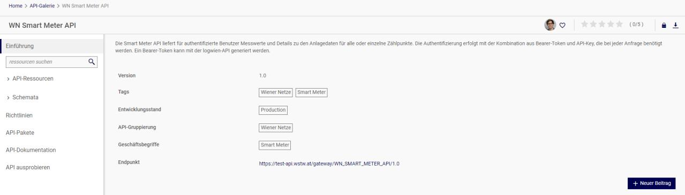

Nach der Registrierung bekommen Sie eine E-Mail, wo Sie die registrierte E-Mail-Adresse bestätigen müssen. Mit einem Klick auf den Link landen Sie wieder auf das API-Portal und können sich dort mit Ihrer angegebenen E-Mail-Adresse und Ihrem Passwort einloggen. Nach dem Login wird Ihnen eine Übersichtseite angezeigt. Dort gibt es drei Kacheln zu sehen: *API-Katalog*, *API Ausprobieren* und *API-Einblicke*.

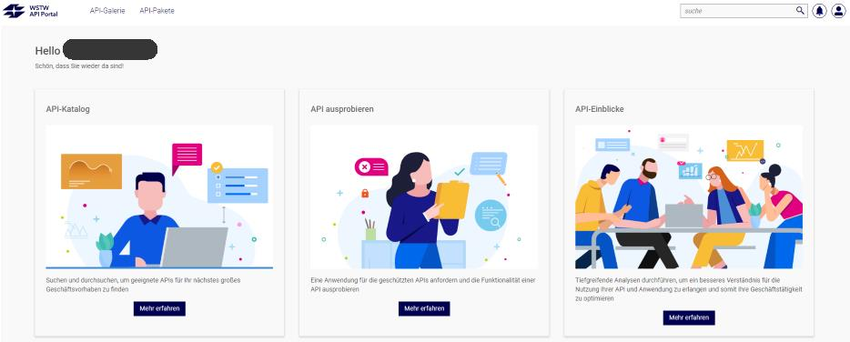

### API-Katalog

Hier bekommen Sie eine Übersicht über alle API-Sammlungen der Wiener Stadtwerke. Unter anderem steht Ihnen hier die API des Smart Meter-Webportals zur Verfügung. Mit einem Klick auf *WN Smart Meter API* öffnet sich die Webseite mit allen relevanten Informationen zur API der Wiener Netze und Smart Meter-Webportal.

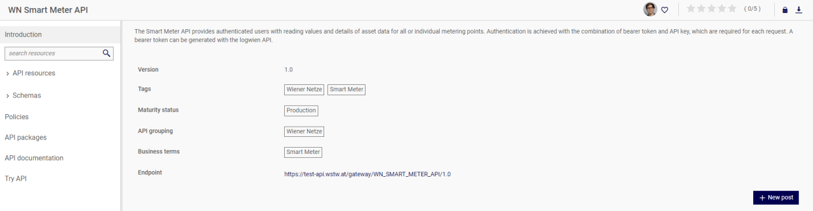

Die Inhalte der Menüs *API Resources* und *Schemas* werden in diesem Dokument später im Detail erfasst.

Unter *Policies* können Sie Informationen über das Autorisierungsverfahren der API einlesen. Die API brauchen API Keys für Authentifizierung und Autorisierung. Ein API Gateway Key, sprich *API Key* (API-Schlüssel) wird für Sie automatisch generiert, wenn Sie eine API-Anwendung erstellen. Weitere Details zu Erstellung der Anwendung finden Sie im Kapitel 3. Der API-Schlüssel dient als Identifikation für die Anwendung der API. Dadurch werden die Abfragen gegen eine Anwendung authentifiziert, d.h. es wird geprüft, ob Sie den richtigen Zugriff für die API-Abfragen besitzen. In dem Portal sind momentan nur vier Abfragen verfügbar, welche gegen einen API-Schlüssels geprüft werden.

Des Weiteren verwendet das API-Portal die Methode OAuth 2.0 als Autorisierung für die API-Abfragen. Basis für diese Methode ist das sogenannte Bearer-Token, welches nur für begrenzte Zeit gültig bleibt. Das Token muss daher immer wieder neu generiert werden, aber im Portal wird es für die Abfragen immer automatisch durch ein Pre-Request Skript erstellt.

Unter *Parent API Packages* können Sie zukünftig verschiedene API-Pakete finden.

In der *API-Dokumentation* finden Sie diverse Dateien relevant für das API-Portal und die Smart Meter API. Hier sind auch die API-Sammlungen für API-Anwendungen wie zum Beispiel Postman und Swagger vorhanden, wenn Sie die Smart Meter API mit einer anderen Applikation ausprobieren wollen.

### API-Einblicke

Auf dieser Seite bekommen Sie eine Statistik für die verfügbare API in Form von einer analytischen Übersicht über die Statistiken der API, welche auf dem Portal benutzt werden. Unter *Anwendungsanalysen* können Sie Statistiken über alle Anwendungen des Portals ansehen. Hier lässt sich nach Zeitraum und Benutzertrends unterscheiden. Sie können die Ansicht auch so anpassen, dass die Statistiken nur für von Ihnen erstellte Anwendungen angezeigt werden. Als Default werden Informationen über alle Anwendungen des API-Portals angezeigt.

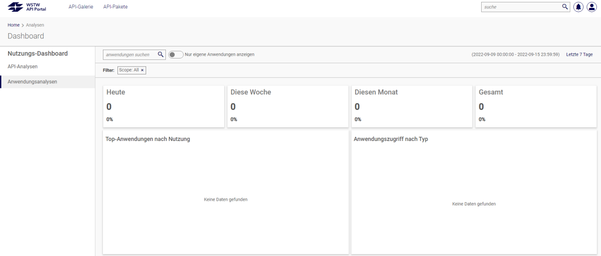

### API ausprobieren

Hier sehen Sie eine Übersicht von allen API-Anwendungen, die zu Ihnen in Verfügung stehen. Sie können auf dieser Seite solche Anwendungen erstellen, mit anderen Usern teilen und Anwendungen deaktivieren/löschen. Die Erstellung einer API-Anwendung wird mit Detail im Kapitel 3 geklärt.

### Drop-down-Menü und Suchfeld

Auf dem Dashboard gibt es ein Suchfeld und ein Drop-down-Menü, die einige nützliche Funktionen anbieten. Durch das Drop-down-Menü haben Sie eine Verknüpfung zu verschiedenen Seiten innerhalb des Portals. Das Steuerelement *Dashboard* können Sie immer auswählen, wenn Sie zur Übersichtseite, sprich Dashboard, schnellstmöglich navigieren wollen. Mit *Anwendungen verwalten* können Sie schnell eine Ansicht über Ihre Anwendungen bekommen. Durch *Meine Teams* können Sie eigene Gruppen erstellen, wenn Sie Ihre Anwendung mit anderen Benutzern teilen wollen. Zu einer Anwendung können mehrere User bzw. Gruppen hinzugefügt werden. Wenn Sie unterschiedliche Einstellungen ändern wollen, können sie diese durch das Steuerelement *\<VornameNachname\>* des Drop-down-Menüs finden. Hier können zum Beispiel Ihr Profilbild, Passwort, persönliche Informationen und Benachrichtigungsvoreinstellungen geändert werden.

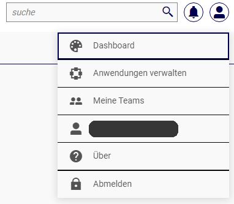

---

## 3. Erstellung der API-Anwendung

Nach der Registrierung im Portal können Sie Ihre eigene API-Anwendung erstellen und mit einer API-Sammlung (Collection) von Ihren beliebten Unternehmen der Wiener Stadtwerke verknüpfen. Alle API-Sammlungen der Wiener Stadtwerke finden Sie unter dem API-Katalog. Es gibt drei Möglichkeiten, wie Sie die Erstellung ihrer eigenen Anwendung starten können:

1. Durch *API ausprobieren*
2. *API-Katalog* → die API-Sammlung Ihrer Wahl
3. Ihr Profil → *Anwendungen Verwalten*

### Erste Möglichkeit: API ausprobieren

Nach dem Login auf die Kachel *API ausprobieren* klicken, danach landen Sie auf die Übersichtseite Ihrer Anwendungen. Dort können Sie mit dem Button *Anwendung erstellen* den Vorgang eröffnen. Auf dem nächsten Schritt können sie die Phase (Umgebung, hier immer auf PROD), APICollection, Name der Anwendung und Beschreibung auswählen:

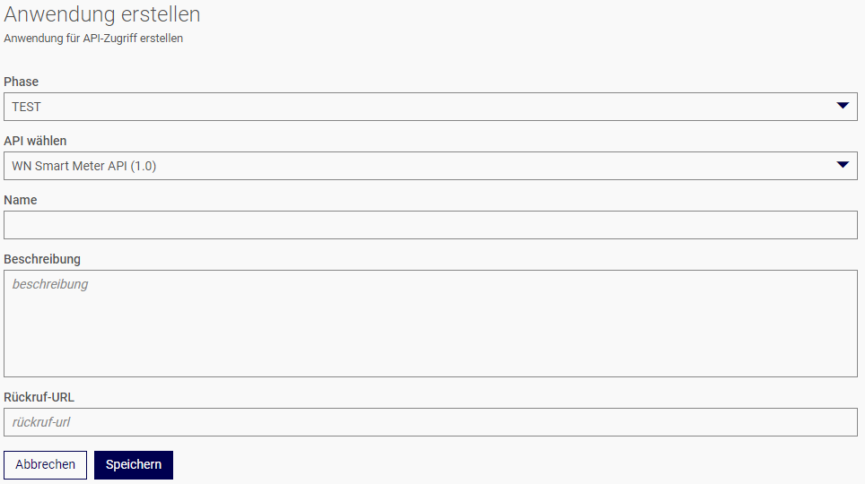

Rückruf-URL (Callback URL) wird normalerweise für die Antwort (Response) der API-Abfrage benutzt. Rückruf-URL ist die Webadresse, wohin die Response geliefert werden sollte. In diesem Portal wird das Feld immer leer gelassen, weil die Rückruf-URL automatisch auf

```url
https://test-api.wienerstadtwerke.at/portal/rest/v1/oauth/callback
```

zugewiesen ist und kann nicht geändert werden.

Nach dem Ausfüllen der benötigten Felder können Sie die Erstellung ihrer Anwendung speichern. Schließlich können Sie Ihre erstellte Anwendung auf der Übersicht ansehen:

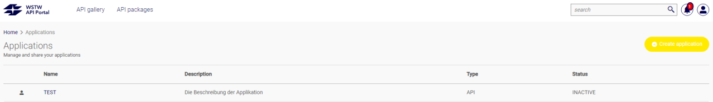

Der Status Ihrer Anwendung bleibt erst kurz *INAKTIV*, weil die Erstellung erst nach paar Minuten abgeschlossen wird. Nach einer erfolgreichen Erstellung wird die Anwendung mit dem Status *LIVE* bezeichnet. Hier können Sie noch Ihre Anwendung bearbeiten, mit anderen Usern oder Teams teilen oder die Anwendung löschen.

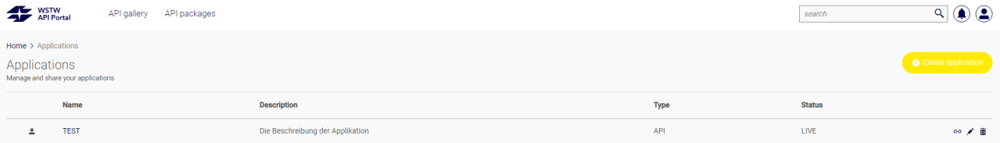

### Zweite Möglichkeit: API-Katalog

Eine Anwendung kann auch durch die API-Collection Menu von Smart Meter API erstellt werden. Wählen Sie zuerst auf dem Dashboard den API-Katalog und danach die API des Smart Meter-Webportals aus.


Nach der Auswahl der API können Sie den Erstellungsprozess oben rechts mit einem Klick auf dem Button *Anwenden* starten:

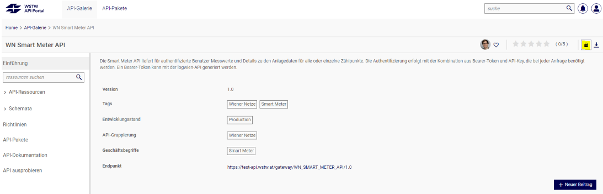

Danach müssen Sie ihre Auswahl einmal durch den Button *Anfordern* bestätigen und, wie während des Kapitels *Erste Möglichkeit* beschrieben, den Vorgang abschließen. Anmerkung: hier können Sie auch die API als JSON- oder YAML-Datei exportieren und mit einer anderen API-Anwendung benutzen.

### Dritte Möglichkeit: Profil-Dropdown

Auf der Startseite können Sie oben rechts die Übersichtseite der Anwendungen auch durch das Dropdownmenu. Hier müssen Sie noch *Anwendungen verwalten* auswählen, um auf die *Anwendungen*-Seite zu landen.

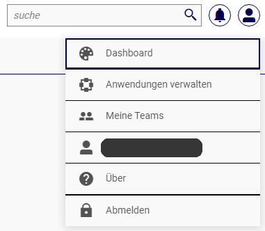

Danach können Sie wieder den Erstellungsprozess durchführen und abschließen.

Wenn Ihre Anwendung erfolgreich veröffentlicht wird, bekommen Sie auch eine automatische E-Mail von der Wiener Stadtwerke, wo nochmal die wichtigsten Informationen über Ihre Anwendung stehen. Unter anderem zu beachten ist hier der API-Schlüssel und an Ihnen mitgeteilten Client Credentials:

- **API-Schlüssel** – wie zum Beispiel: `d4ba6184-ca88-4246-ai82-14da3o5dl520`
- **Client-ID** – Diese wird Ihnen individuell mitgeteilt
- **Client-Secret** – Dieses wird Ihnen individuell mitgeteilt

> **Bitte beachten, dass Sie die an Ihnen mitgeteilten Client Credentials immer vertraulich behandeln!**

---

## 4. Verknüpfung des Smart Meter-Webportals mit API-Portal

Es gibt drei Voraussetzungen, um das Anwenderprofil aus dem Smart Meter-Webportal mit Ihrer API-Anwendung im Portal der Wiener Stadtwerke zu verknüpfen:

1. Sie sind im API-Portal der WSTW erfolgreich registriert.
2. Sie haben eine API-Anwendung erstellt oder haben einen Zugang für eine Anwendung.
3. Sie sind im Smart Meter-Webportal registriert und haben dort verfügbare Daten.

Wenn Sie diese drei Voraussetzungen erfüllen, müssen Sie zuerst eine E-Mail an das Support-Team des Smart Meter-Portals (support.sm-portal(at)wienit.at) schicken. *Eine E-Mail-Vorlage finden Sie im Portal unter API-Dokumentation.* Wir benötigen zwei Informationen, um Ihre API-Anwendung mit dem Smart Meter-Webportal verknüpfen zu können: der Name der Anwendung und die E-Mail-Adresse, welche im Smart Meter-Webportal registriert ist.

Nachdem wir die E-Mail von Ihnen bekommen haben, erstellen wir Ihnen eine unikale Client-ID mit einem Client-Secret. Nach der Erstellung der sogenannten Client Credentials bekommen Sie von uns eine Bestätigungsmail. Ihre persönliche Client Credentials können Sie dann in dem Smart Meter-Businessportal aufrufen. Sie müssen sich zuerst im Businessportal einloggen und auf *Anlagendaten* → *Vertragsverbindung hinzufügen/entfernen* → *API* navigieren. Dort können Sie die für Ihnen erstellte Client-ID und Client-Secret ansehen.

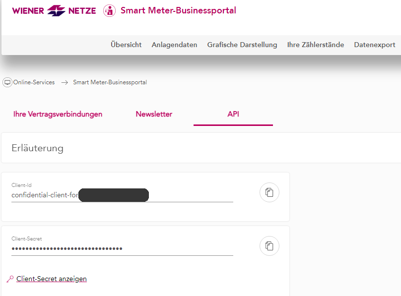

Bitte beachten, es können Daten aus verschiedenen Profilen des Smart Meter-Webportals mit einer API-Anwendung verknüpft werden.

---

## 5. API-Abfragen im API-Portal

Eine API-Abfrage kann in der *WN Smart Meter API* durchgeführt werden. Diese kann von dem *Dashboard* aus mit einem Klick auf den *API-Katalog* gefunden werden. Dort mit einem Klick auf dem Namen der API landen Sie auf die Seite, wo Sie einen Überblick bzw. erste Informationen über die API bekommen.

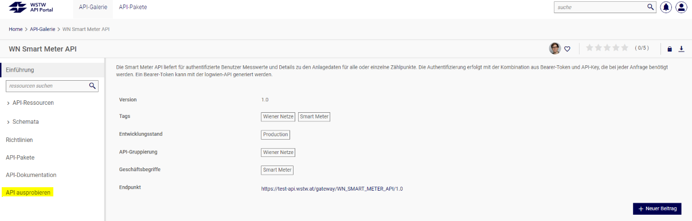

In *API-Ressourcen* und *Schemata* bekommen Sie Informationen zu den API-Abfragen des Smart Meter-Webportals. Diese Informationen sind eng miteinander verbunden. Für jede Abfrage gibt es ein dazugehöriges Schema, welches auf der Seite aufgelistet ist.

### Abfrage 1 und Schema 4: getZaehlpunktMesswerte

Die API für Zählpunkt-spezifischer Verbrauchs- und Zählerdaten ist grundsätzlich so aufgebaut, dass es bestimmte Parameter gebraucht werden, um die Abfrage erfolgreich ausführen zu können. Hier gibt es insgesamt zwei Arten von Parametern zu beachten. Ein sogenannter *Pfad-Parameter* leitet die Abfrage zu einer bestimmten Ressource, sprich einer Speicherstelle in einer Datenbank. In diesem Fall begrenzt der Pfad-Parameter die Abfrage zu einem einzelnen Zählpunkt und wird hier als `zaehlpunkt` bezeichnet. Zusätzlich gibt es noch die *Abfrage-Parameter*, welche dazu dienen, die API-Response mit bestimmten Filtern einzuschränken. In dieser API gibt es folgende Abfrage-Parameter:

- **datumBis** – `"YYYY-MM-DD"`
- **wertetyp** – `"QUARTER_HOUR"`, `"DAY"`, `"METER_READ"`
- **datumVon** – `"YYYY-MM-DD"`

Mit den Parametern kann man zum Beispiel einen bestimmten Zeitraum auswählen, wenn man die Messwerte nur für bestimmten Zeitraum aufrufen will. Über `wertetyp` lässt sich die Granularität den Messwerten steuern, also ob Tages- oder Viertelstundenwerte bzw. Zählerdaten abgerufen werden sollen. Hinweis: bei dem Parameter wird immer ein roter Text „benötigt" angezeigt, wenn der Parameter wesentlich für die Ausführung der Abfrage ist.

Die Payload bzw. Nutzlast ist hier folgendermaßen gebaut:

```json
{
    "zaehlpunkt": "numggfOhOUA",
    "zaehlwerke": [
        {
            "einheit": "",
            "messwerte": [
                {
                    "messwert": 722295609.6998788,
                    "qualitaet": "EST",
                    "zeitBis": "2022-07-31T02:22:06+0000",
                    "zeitVon": "2022-07-25T23:13:44+0000"
                }
            ],
            "obisCode": "GLaMy"
        }
    ]
}
```

Die Qualität sagt hier aus, ob es sich um einen tatsächlichen (VAL) oder geschätzten/berechneten (EST) Wert handelt. Ein Schema gibt Auskunft, welche Objekte in der Nutzlast angezeigt werden. Wichtig zu beachten ist, wenn ein Objekt oder Element im Schema als „benötigt" bezeichnet ist, sollte dieses Objekt in der Ausgabe immer vorhanden sein.

### Abfrage 2 und Schema 3: getZaehlpunkteMesswerte

Diese Abfrage liefert die Verbrauchs- und Zählerdaten für alle Zählpunkte, die zu einem User des Smart Meter-Webportals registriert sind. Diese Abfrage ist analog zu der ersten Abfrage gebaut. Die Pfad-Parameter sind ähnlich zur zweiten Abfrage, jedoch wird der Parameter für einen spezifischen Zählpunkt nicht mitgegeben.

### Abfrage 3 und Schema 1: getZaehlpunkteAnlagendaten

Diese Abfrage liefert die Anlagedaten für alle Zählpunkte. Nach der Auswahl des GET-Requests können die verschiedenen für die Abfrage mitzugebenden Werte gesetzt werden. Die Identifizierung aller Anlagen wird über den Token kundenspezifisch gewährleistet. Hier gibt es eine Abfrage-Parameter, welche ausgefüllt werden soll:

- **resultType** – `"SMART_METER"`, `"ALL"`

Jedoch kann dieses Feld auch leer gelassen werden.

Anlagetyp „ALL" liefert Daten für alle Zählpunkte, inklusiv Non-Smart-Meter, die sogenannten Ferraris-Zähler. Mit dem Anlagetyp „SMART_METER" werden nur Smart Meter angezeigt.

Die Ausgabe sieht hier anders aus. Eine erfolgreiche Abfrage liefert Daten zu Anlage, Gerät, IDEX-Prozessen, Verbrauchstelle, Zählpunktname und Zählpunktnummer. Unter dem Schema 2 sind noch die benötigten Elemente aufgelistet, die bei einer erfolgreichen Abfrage auf jeden Fall geliefert werden. Alle anderen Objekte werden nur dann geliefert, wenn es für diese Felder Daten existiert.

### Abfrage 4 und Schema 1: getZaehlpunktAnlagendaten

Diese Abfrage ist analog zur dritten Abfrage gebaut und liefert Anlagedaten für einen spezifischen Zählpunkt, insofern muss dieser Zählpunkt vor der Ausführung der API definiert werden.

Die Nutzlast ist folgendermaßen aufgebaut:

```json
{
    "anlage": {
        "anlage": "eA",
        "sparte": "GAS",
        "typ": "BEZUG"
    },
    "geraet": {
        "equipmentnummer": "XDnveNelaKRSUN",
        "geraetenummer": "RLPEcaScQimB"
    },
    "idex": {
        "customerInterface": "inactive",
        "displayLocked": false,
        "granularity": "DAY"
    },
    "verbrauchsstelle": {
        "haus": "etUy",
        "hausnummer1": "",
        "hausnummer2": "RbnGt",
        "land": "NxhwImqd",
        "ort": "xWrInI",
        "postleitzahl": "pXeBngFMWDLhA",
        "stockwerk": "gQQxSyw",
        "strasse": "nL",
        "strasseZusatz": "fGCHfrNJWDteT",
        "tuernummer": "BiCXFMT"
    },
    "zaehlpunktname": "yIoypcEbBWTej",
    "zaehlpunktnummer": "THtA"
}
```

---

## 6. Durchführung einer Abfrage des Smart Meter-Webportals

Um die API des Smart Meter-Webportals selbst testen zu können, müssen Sie zuerst drei Voraussetzungen erfüllen:

- Erfolgreiche Registrierung im API-Portal der Wiener Stadtwerke.
- Einen Zugang für eine Anwendung besitzen, welche Sie entweder selbst erstellten oder welche mit Ihnen geteilt wurde.
- Sie haben die Anwendung mit einem Profil aus dem Smart Meter-Webportal verknüpft.

Sind diese Voraussetzungen erfüllt, können Sie die API ausprobieren bzw. durchführen. Diese Funktion steht Ihnen in der *WN Smart Meter API* zur Verfügung.

Nun können Sie ihre beliebte API-Abfrage auswählen und die benötigten Parameter ausfüllen:

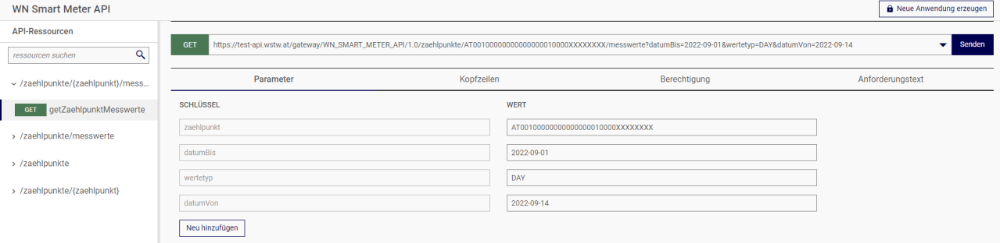

Die Abfrage bekommt die erforderlichen Informationen zur Authentifikation und Autorisierung aus Ihrer Anwendung, die mit dem Profil von Smart Meter-Webportal verknüpft ist. Allerdings ist es nicht notwendig, andere Parameter einfügen zu müssen. Nach der Parameter-Eingabe können Sie einfach auf *Senden* klicken.

Sollten Sie trotzdem keine Berechtigung für die Abfrage haben, müssen Sie die Informationen manuell eintragen.

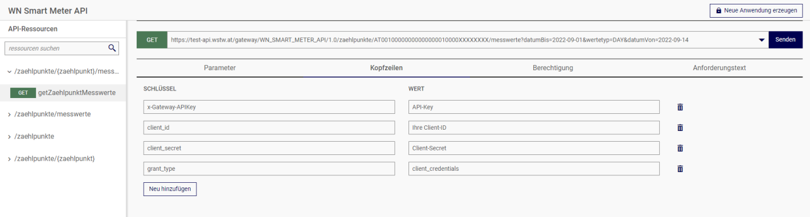

Diese Informationen sind relevant, um die Autorisierung der API erfolgreich abzuschließen. Solche Parameter sind in dem Reiter *Kopfzeilen* (Header) einzutragen. Zuerst müssen Sie auf *Neu hinzufügen* klicken und danach die Kopfzeile mit einem Wert ausfüllen.

Folgende Kopfzeilen bzw. Parameter sind hier einzufügen:

| Parameter | Wert |
| ----------- | ------ |
| **x-Gateway-APIKey** | Finden Sie in den Einstellungen der Anwendung |
| **client_id** | Diese wird Ihnen individuell mitgeteilt |
| **client_secret** | Dieses wird Ihnen individuell mitgeteilt |
| **grant_type** | `client_credentials` |
| **Accept** | `application/json` * |

\* Nicht zwingend erforderlich.

Auf dem Reiter *Berechtigung* muss zuerst die richtige Anwendung (Application) und der Berechtigungstyp „API key" ausgewählt sein. Sind alle Informationen eingetragen, können sie die Abfrage mit einem Klick auf *Senden* starten.

### Ergebnis der Abfrage

Das Ergebnis wird in einem JSON-Format geliefert. Wenn eine Abfrage erfolgreich durchgeführt wird, bekommt man einen HTTP-Statuscode **200 OK**. Dieser Statuscode heißt, dass die Abfrage-Operation erfolgreich durchgeführt wurde. Dabei bekommen Sie auch die vorher definierten Informationen. Es gibt noch jeder Menge zusätzliche Statuscodes bei der API. Hier sind ein paar Statuscodes, die regelmäßig vorkommen können:

| Statuscode | Beschreibung |
| ----------- | ------------ |
| **400 Bad Request** | Die Abfrage ist inkorrekt aufgebaut. Mögliche Ursache könnte eine fehlerhafte Syntax sein. |
| **403 Forbidden** | Benutzer ist nicht berechtigt, die Abfrage durchzuführen. |
| **404 Not Found** | API-Ressource wurde nicht gefunden. |
| **408 Request Timeout** | Die Abfrage konnte nicht innerhalb des vom Server erlaubten Zeitraum durchgeführt werden. |
| **500 Internal Server Error** | Genereller Statuscode für unerwartete Fehler im Server. |

Mit einer erfolgreichen Abfrage werden in der Nutzlast einige Informationen geliefert. Wie im Kapitel 5 schon erwähnt wurde, geben die Schemata Richtlinien für die API-Nutzlasten. Die Nutzlast bzw. Payload ist immer abhängig von der Abfrage. Eine Payload für eine Abfrage über Zählpunktdaten bzw. Anlagendaten liefert Daten wie zum Beispiel Adressdaten der Verbrauchstelle, Technische Stammdaten (u.a. Zählpunkt-, Geräte- und Anlagennummern) und je nach Verfügbarkeit auch Daten zu den IDEX-Funktionen. Für Messwerte-Abfragen werden neben der tatsächlichen Messwerten Daten wie Zählpunkt, OBIS-Kennzahlen (gemäß SAP IS-U), Wertetyp und Zeitpunkt geliefert.
